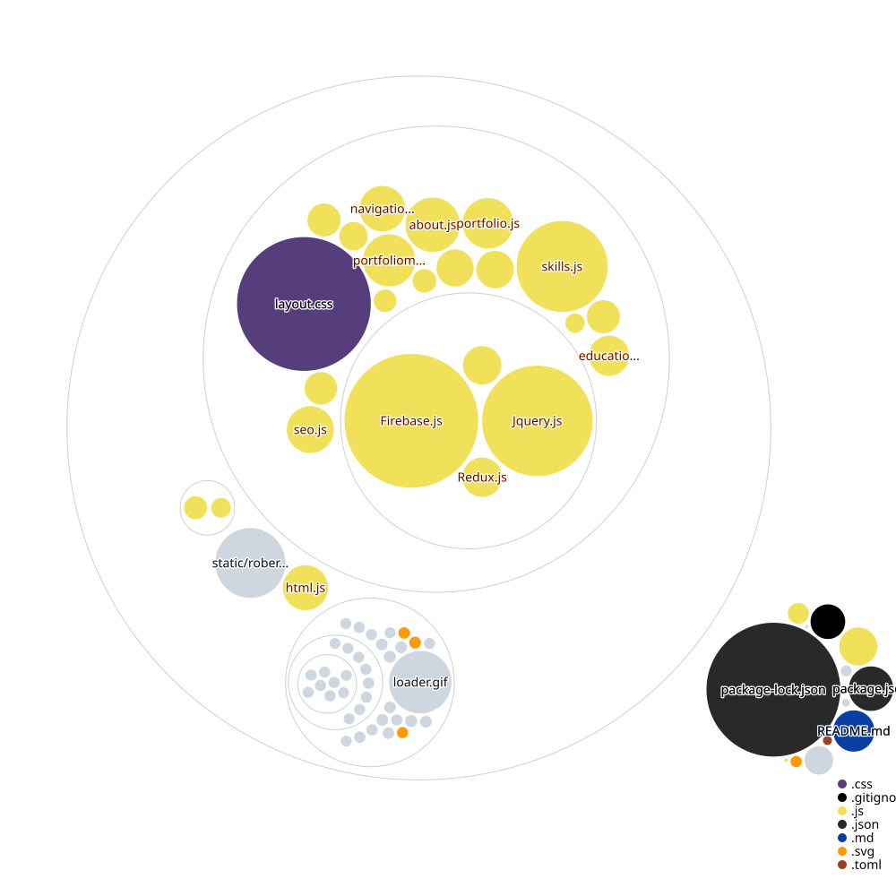

# robertperez.io v2

Personal portfolio/bio site for Roberto Perez — live at [robertperez.io](https://robertperez.io).

## Stack

- **Framework**: Gatsby 4 (React 17)
- **Hosting**: Netlify (automatic CI/CD from `main` branch)
- **Plugins**: gatsby-plugin-image, gatsby-plugin-sharp, gatsby-plugin-manifest, gatsby-plugin-react-helmet, gatsby-plugin-smoothscroll, gatsby-plugin-google-analytics
- **UI**: react-icons, react-slick (testimonials slider), react-modal (portfolio lightbox)

## Sections

| Section | Component | Notes |
| --- | --- | --- |
| Banner / Hero | `banner.js` | Name, tagline, social links |
| About | `about.js` | Bio, contact details, resume PDF download |
| Resume | `resume.js` | Wraps Work, Education, Skills |
| Portfolio | `portfolio.js` | Project cards with modal lightboxes |
| Testimonials | `testimonials.js` | react-slick carousel |
| Footer | `footer.js` | Social links, back-to-top |

## Development

```bash
npm install
npm run develop    # dev server at localhost:8000
npm run build      # production build
npm run serve      # preview production build
npm run clean      # clear .cache and public/
```

> **Note:** Node 16–18 is required for Gatsby 4. Node 20+ requires Gatsby 5.

## Deploy

Deployed via Netlify. Every push to `main` triggers a production build. The Netlify site ID is in `netlify.toml`.

## Repo Visualization


